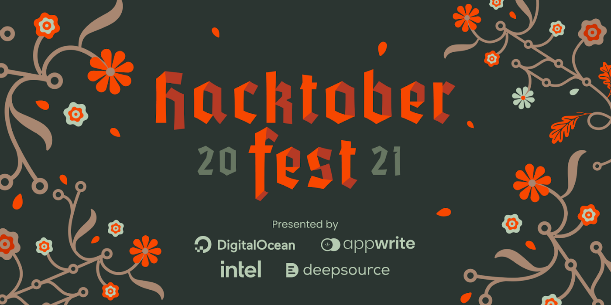
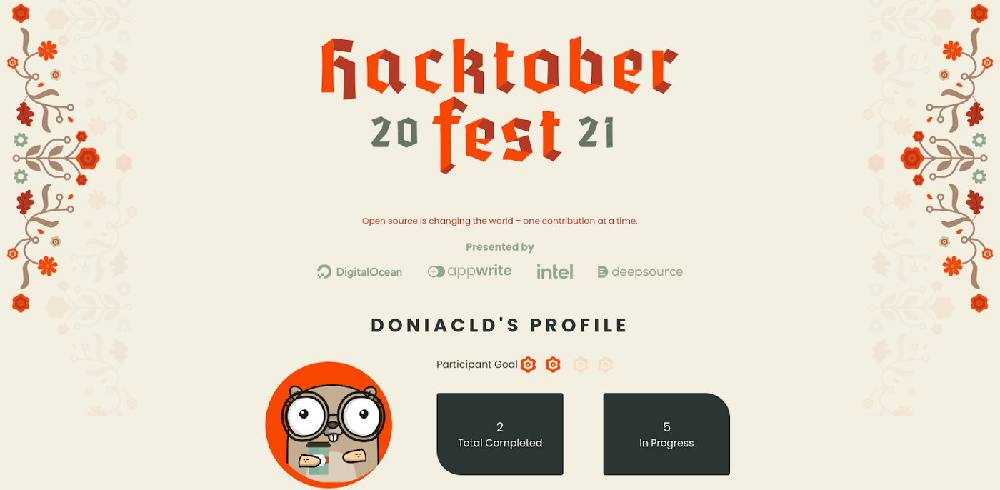

How I discovered the vast open source world thanks to the Hackoberfest.

Three weeks ago, while going through the last posts on [Hashnode](https://dev.to/doniacld), I landed on [Beginners’s guide to Hacktoberfest 2021](https://ayushirawat.com/beginners-guide-to-hacktoberfest-2021?source=newsletter) post from Ayushi Rawat.

> Hacktoberfest, in its 8th year, is a month-long celebration of open source software run by DigitalOcean. During the month of October, we invite you to join open-source software enthusiasts, beginners, and the developer community by contributing to open-source projects.

## My fears

I have several years of development experience now but I never overcome this fear of participating in an open source project. I was worried about having my code not qualitative enough and judged by software gurus. What a shame ?! I found Hacktoberfest a great challenge to put a foot in the door.
Following the tutorial step by step, I searched for candidates issues/projects, here is the [filter](https://github.com/search?l=Go&p=2&q=is%3Aopen+is%3Aissue+label%3A%22good+first+issue%22+no%3Aassignee&type=Issues) used. Golang is the language I am quite proficient at, this filter associated with a good-first-issue label seemed to do the job pretty well since it returned a plethora of issues. Hacktoberfest provides a list of all participating projects per language, [Go Repositories](https://hacktoberfest-projects.vercel.app/repos/go).

## My contributions

I found this little size project named [Kidle](https://github.com/kidle-dev/kidle), a Kubernetes operator to idle or wakeup resources with a [good-first-issue](https://github.com/kidle-dev/kidle/issues/21)! 
After posting my first comment saying I was interested, the stress invaded my body. [Nicolas](https://github.com/orphaner), the maintainer was asking for my opinion (Am I legitimate to have an opinion on your tool ?). 
I take my time to search, check the code and give what I assumed the best answers I could give at this point.

Discussing with Nicolas was great, after a few comments, I felt I was already learning new things: suggestions display, check related projects, github discussions conventions, acronyms. 
After agreeing on the scope of the issue, the fun began: let’s code! For the record, it took me three weeks to test and push a final [pull request](https://github.com/kidle-dev/kidle/pull/25).

The day after, I talked about the Hacktoberfest to Salvador (architect colleague and my technical/career unofficial mentor). He is known for contributing to [revive](https://github.com/mgechev/revive) a Golang linter. 
We decided that I could contribute by solving these [3 issues](https://github.com/mgechev/revive/issues?q=is%3Aissue+is%3Aclosed+assignee%3Adoniacld) (2 new rules and add a docker image to the release).

Since this moment, I have been coding every available hour I had. It felt so reviving to spend time coding on new projects, rewarding to solve issues for people actually using the tool. 
Here are all my [contributions](https://hacktoberfestchecker.jenko.me/user/doniacld).

_Contributions on my Hacktoberfest profile_

Now, my 4PRs are submitted and approved, I am waiting for the 15 days maturation to finish the challenge! 
A special thanks for the Hacktoberfest, [Salvador](https://github.com/chavacava) and Nicolas for guiding me in the mysterious and beautiful open source world. 
I will definitely not leave it, it is now part of my tech routine.

## Takeaways

* Don’t be afraid, open source is about helping and not judging
* Agree on the scope with maintainers before pushing any pull requests
* Start with small and easy changes
* It is not only October but all year long
