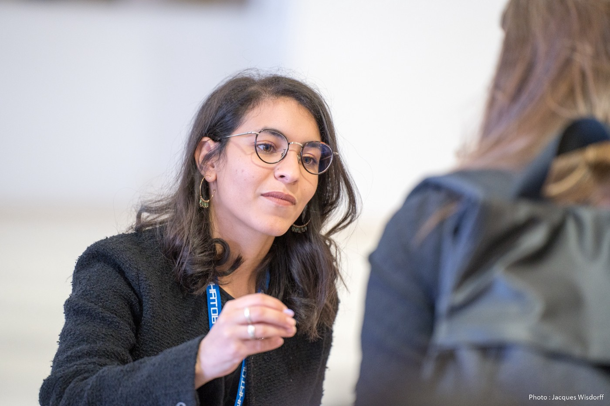

_Photo credit [Jacques Wisdorff](https://jacques-wisdorff.jimdosite.com/) 🎬 — hosting people during the Trophies Women In Tech South 2022 organised by [WHAT06](https://what06.fr/) — Women Hackers Action Tank at the Palais des Festivals et des Congrès de Cannes_

Follow me today in my event organisation throwback, and check the surprise at the end!

You can find the french version on [LinkedIn](https://www.linkedin.com/feed/update/urn:li:activity:6930081694972575745/).

For the one that I have never been close to me, you will often hear that I am an “enthusiastic” person. I genuinely love people, the folks, the stories, creating bridges and connections.

Back at [Polytech Grenoble](https://www.linkedin.com/school/polytech-grenoble/), I was co-leading the organisation of the classes with my colleague [Arnaud Canton](https://www.linkedin.com/in/a-canton/), it was such a pleasure to organise non-formal moments outside of the routine of the lesson, to just reunite, going to the restaurant or even organising board games nights.

In the professional world, I found a role pretty similar within SII Sophia, I have been the Siite Leader for almost 4 years, organising picnics, resto and escape games…

Yet, last year I realised that beyond having fun moments, I wanted to combine tech and people. Which explains my involvement within WHAT06 (thanks to [Carole Malbrancq](https://www.linkedin.com/in/carole-malbrancq-39273711/) to promote women in tech and where I learn a lot and that I decided to create a new Google Developer Group chapter in our area.

After two successful Sophia Tech Connects, doubts and questions (thanks to [Alessandro Palmieri](https://www.linkedin.com/in/alepalmieri/) for taking the time to answer them), we finally begin this new adventure with [Fabrice Fontenoy](https://www.linkedin.com/in/fabricefontenoy/) and now [Mathilde El Mouktafi](https://www.linkedin.com/in/mathilde-el-mouktafi/). Our ambition is pretty humble, building a community in Sophia Antipolis of tech people that lift others and create a technical and human emulation with no ego.

Lat weeks, we noticed a decrease in participation. Is it because of the move to “GDG”? Topics were way more specific? Talks were in English? Or simply because the novelty faded out?

Anyway, we are convinced that we can build a strong community, positive, instructive, and inclusive in our region which hosts a plethora of tech people. A wise man told me that it takes time to build a community (cc [Julien Landure](https://www.linkedin.com/in/jlandure/) :) ), so we are patient and perseverant.

We will continue to be remotely reunited monthly for a tech talk and sometimes in-person.

Cause you know tech is not your only motivation, we have the pleasure to announce that the first 20 registered attendees to our first IRL meetup will have a drink offered.

🍺🍹 **Be sure to join us on the 31st of May at MK**

👉🏽 RSVP here

I am more than excited to meet you, to see you again, and to finally see you if we met on LinkedIn.

See you there!
