Last week, I gave my first talk on a stage at a conference with a mic and everything: this happened at [GopherCon Europe](https://gophercon.eu/). 
It was an amazing and enriching experience. I wanted to share with you the story behind it and a sum up of the talks I attended.

TL;DR: If you are only interested in the recap of the conference, you can skip directly to the “Berlin, an underground city” section.

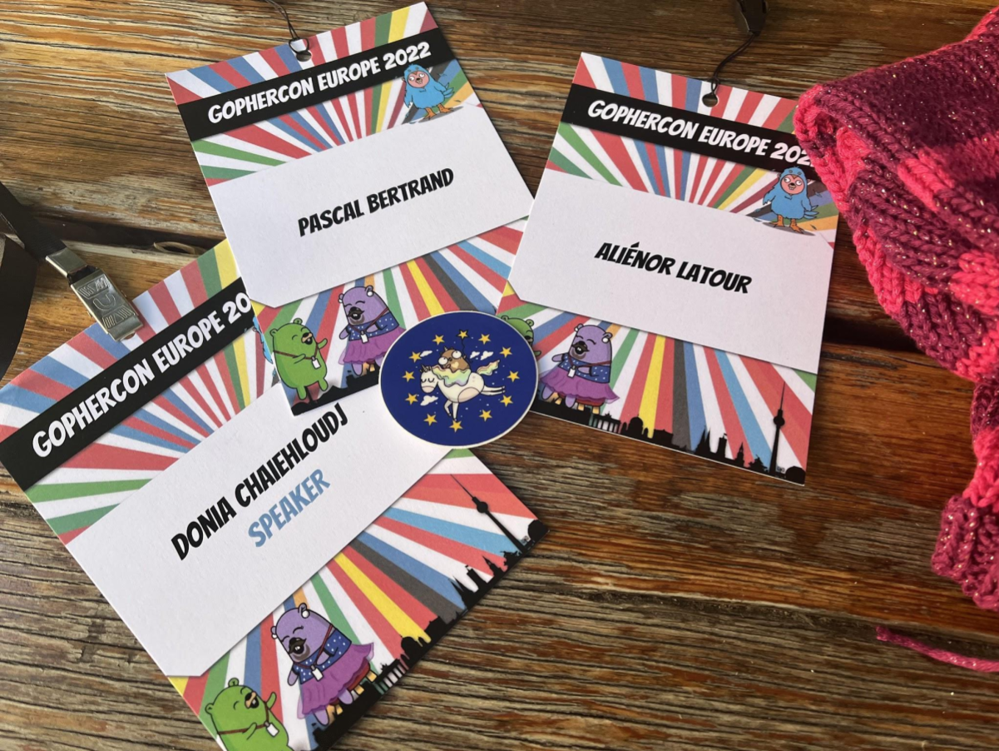

# How it started

Last November, I posted an article called: My Top 5 Women Motivational Speakers in Cloud-Native Development in 2021. 
I was looking for role models and dreaming about what I could realise. I set myself objectives such as learning some tech learning, writing an article per month, starting a tech community, 
and giving talks, but it was too much at the same time — and I still have many articles in my WIP folder.

While I was working on building a community on the Google Developer Group, I discovered a program named [Women Developer Academy](https://medium.com/googledeveloperseurope/empowering-women-in-tech-to-thrive-join-the-women-developer-academy-europe-2022-fa48fd69ebf5). 
The goal is to accompany women in tech — women who are on the path of sharing learnings by creating content and having an interest in Google technologies, which, in my case, is Go.

During this one-month program, I met an amazing community, and I learned how to:

- build and cultivate my confidence
- write an abstract
- make a technical presentation
- select a topic

The last session of the program was a 5 minutes presentation using all the tips and tricks our mentors taught us.

During this time, since my partner and I were talking about monitoring the hen house using [TinyGo](https://tinygo.org/), 
I decided to make an intro to TinyGo and this was the beginning of the story! At the end of the program, they told us to go to meetups and conferences. Do not say it twice!

First, I had the opportunity to give my [TinyGo introduction](https://www.youtube.com/watch?v=2v91Rff4Ipk) for the [Women Techmakers Berlin](https://wtmberlin.com/) remotely which was a good first step.

In parallel, I applied to all the Go conferences I could find. To draft my abstract, I completed the program learning with articles specific to GopherCon especially the series from [Gopher Academy](https://blog.gopheracademy.com/gophercon-2017/writing-a-successful-gophercon-proposal/).
And here I am, accepted to the GopherCon Europe in Berlin!

# The storm
I remember reading very good tips from Carolyn Van Slyck in her article [Submit a Talk to GopherCon](https://carolynvanslyck.com/blog/2018/12/talk-at-gophercon/)! 
_“Don’t learn something just in time for the conference. That is stressful and probably won’t go over well.”_ That I did not apply… A month before the conference, nothing of the submitted project existed. I had to build everything in 3 weeks with a lot of stress, I might admit. Don’t do it. Just apply next year. When I admitted it to the TinyGo community on slack one month before, their answer was: “Conference Driven Development”, “Talk Driven Development”.

Anyway, I worked many evenings and weekends to make this project work and made the slides ready for the due date. And I am very proud that I managed it with the help and support of my partner, friends, my mentor and the TinyGo community of course. Being surrounded by people that care for your success has been the most important thing for me this last month.

And the day to fly to Berlin came.

# Berlin, an underground city!

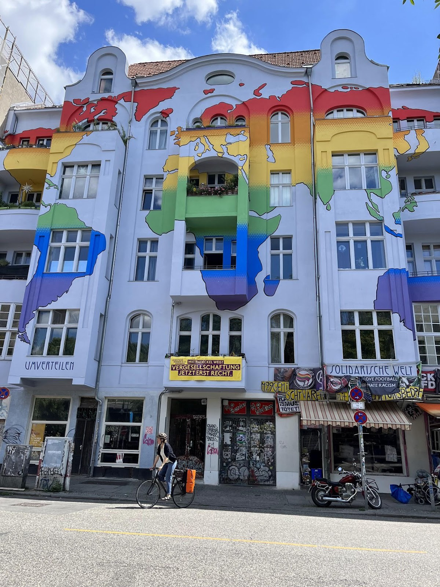

## Thursday 28, community event

GopherCon organisers were proposing an alternative Berlin tour in the morning. It was a great way to discover the history of the city with a focus on the LGBT and street art aspects. I had the chance to meet the first gophers of the conference and bond with some of them.

The afternoon was dedicated to meeting more gophers and discussing at round tables about defined topics. I had the opportunity to meet Ale and Bill Kennedy, big names of the Go community but before anything else amazing human beings. With my dearest friends, we had 15 mins of conversation and advice from Bill Kennedy… very well-invested time.

The organisers and the tech team gave me the opportunity to test my material on the stage to make sure everything was okay. And… it was not okay. My Mac plugged in through HDMI was not sending any signal. If you are facing this problem at a conference, save your time try a USB-C adapter in between.

I ended my afternoon with engineers from Torq and Google DevRel Valentin Deleplace. We had a very interesting conversation about microservices architecture, with or without gateways, what to expose the client and how. You can go further by reading Kotya’s articles about [gateways here](https://grpcguide.com/building-api-gateway-for-grpc).

## Friday 29, workshops or hack session

I decided to not attend any workshop because I wanted to join the TinyGo hack session, of course! 
There were many boards and materials available with tutorials to play with sensors and the latest feature of TinyGo (the USB MIDI): 
build a MIDI (Musical Instrument Digital Interface) and play music. I managed to play only one note, but I decided to do more in the 
future and explore the funniest feature of TinyGo.

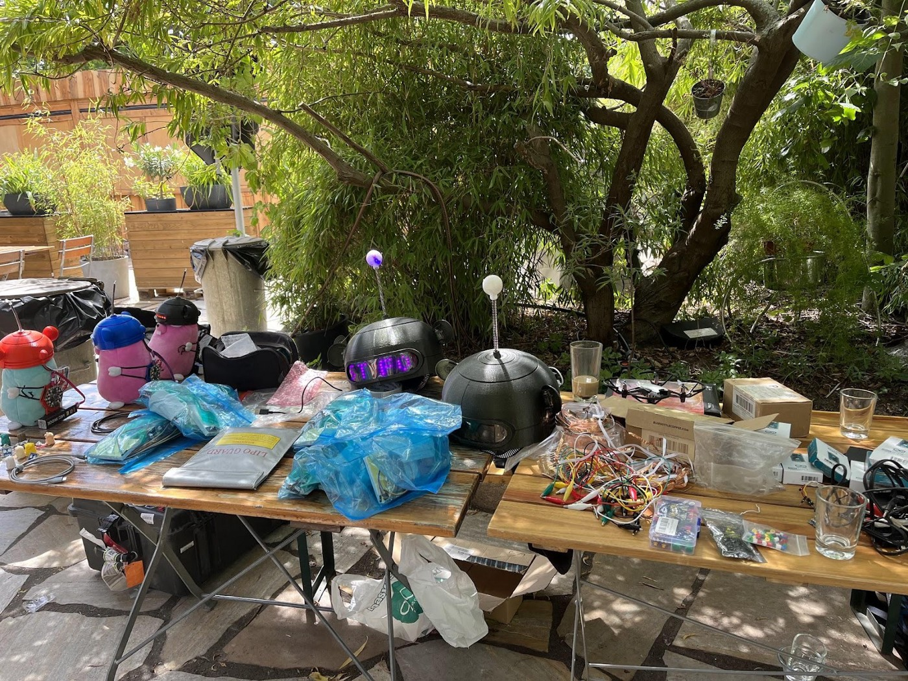

I had the chance to meet TinyGo community’s big names: Ron Evans and Daniel Esteban. It was a huge moment for me and, after an afternoon, you just realised they are humans like you.

I also had an awesome gift from Ron Evans, a pybadge (Adafruit) for the next coming conferences. (
I almost cried at this point.) Spent my evening rehearsing my talk and flashing my board at the hotel.

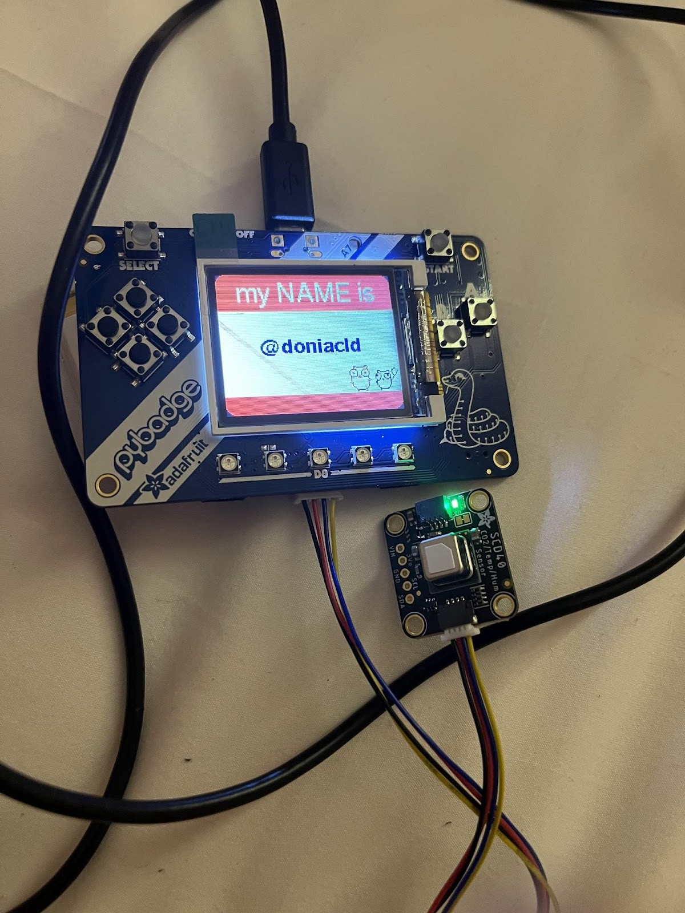

During lunch, I finally met Adelina Simion. Why finally? Because a few months ago, after her interview for Eddie Jaoude, I asked her kindly if she would be my mentor. Since then, we have called each other once a month and she has been very present to help me manage conferences’ timing and content. Have a mentor, have several mentors.

## Saturday 30, THE day
It is THE day, you can imagine how nervous I was. After the last rehearsal and a nice breakfast (all the food was very good by the way), the opening words were held. We were in the front row to encourage Marian for her talk about CLI (and next to Bill Kennedy).

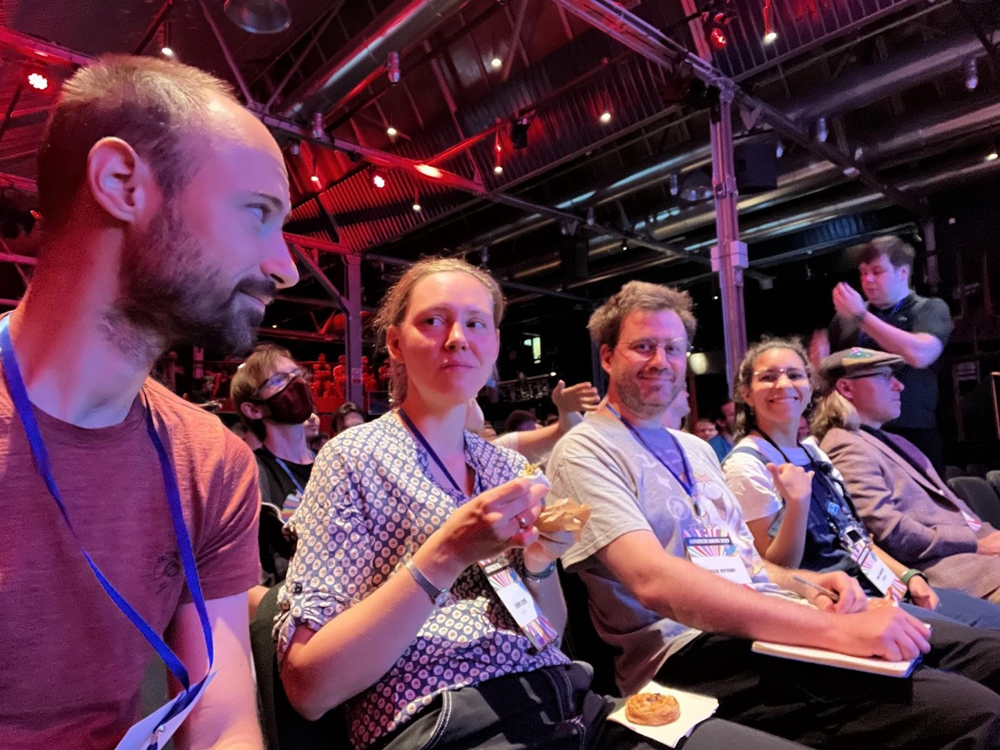

### Reinventing CLI with Go, Marian Montagnino
Marian has been using computers since her very young age and has reunited in this talk her love for text-based apps and Go. 
She presented the best practices when building a CLI, especially for humans and the Go tools that are available to build one easily such as Cobra, 
Survey and TermDash. I fell in love with TermDash.

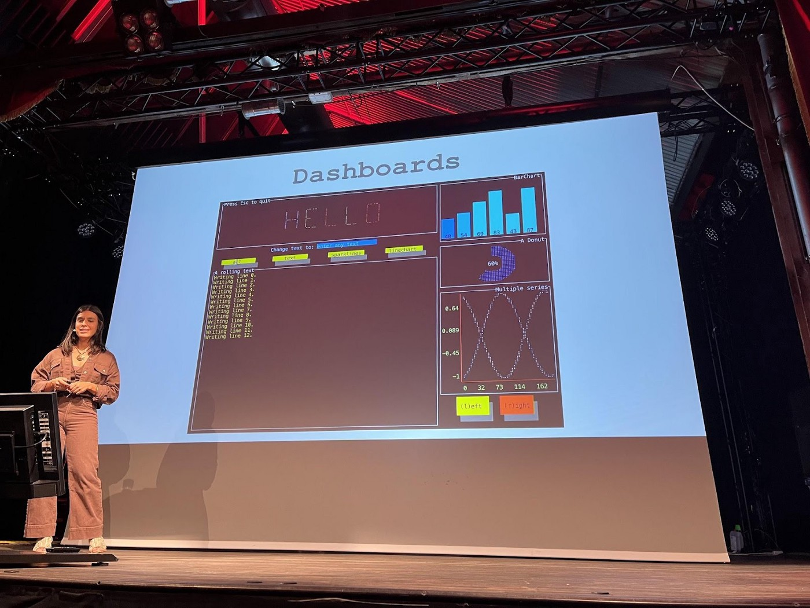

### Respecting memory limits in Go, Michael Knyszek
Michael is an engineer at Google in the Go team and is an expert on memory management. 
In his talk, he explained the next memory feature from Go 1.19, which was just around the corner. 
He gave several examples using one graphic on how to customize the peak memory parameter. 
The point of the talk was to reduce the number of calls to the GC (Garbage Collector) by using as much memory as possible. so the Garbage Collector is called. You can go check the garbage collector guide on [go documentation](https://tip.golang.org/doc/gc-guide) and play with the parameters.

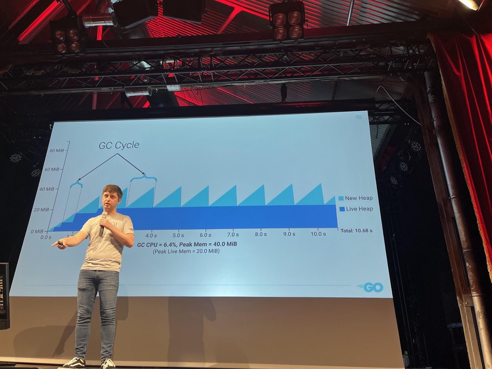

### From service to platform: a ranking system in Go, Konrad Reiche
Konrad is a software engineer at Reddit where they publish recommended feeds for users. 
In his talk, he shared with us how you can transform a service getting feeds into a generic platform to serve bricks for dev teams. 
He reminded us of the need for refactoring to reduce the accidental and intentional complexity of code. 
This is the talk I recalled the most because we build feeds at Powder (where I work).

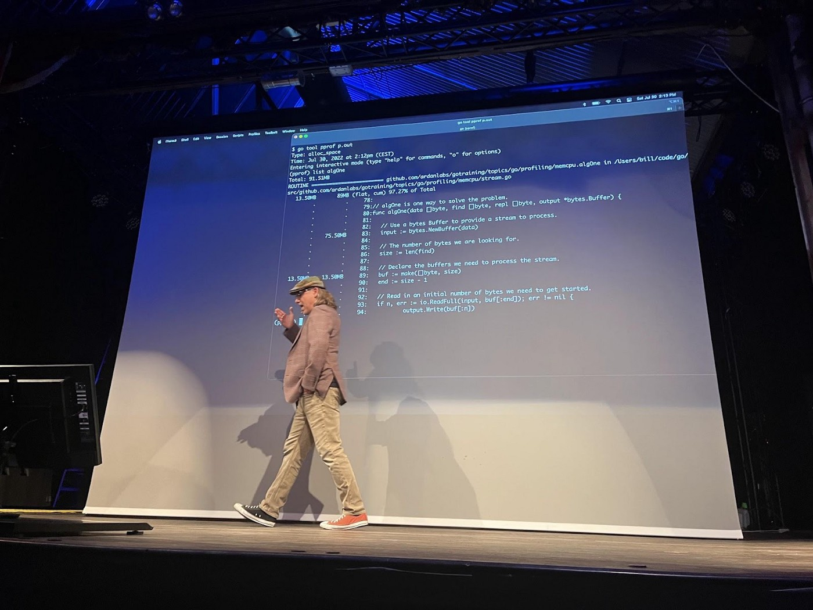

### Practical memory profiling, Bill Kennedy

Bill stepped up to sadly replace Aditya that could not make it to Berlin. The show could be summed up in one question: 
Bill vs Tyron, how to get a 0 memory allocation algorithm? Bill made a whole story fighting Tyron to turn his algorithm into a 0 memory 
allocation like Tyron’s. To do so, he used algorithm benchmarks to measure the memory allocations and the size of the program and then 
iterate using pprof. He fixed line by line where memory was allocated giving examples such as using &Buffer{buf: buf} directly instead 
of bytes.NewBuffer(raw).

I did get why they said after the workshop: _“Bill is very good at keeping your attention”_.

### TinyGo: Getting the upper hen, Donia Chaiehloudj (myself)

Mat Ryer co-hosting the event had the great idea of having Ron Evans and Daniel Esteban for my introduction. 
I was very honoured and intimated, of course. The goal of my talk was to give a brief and practical introduction to TinyGo 
and explain how I used it to retrieve temperature and humidity and display values on Grafana dashboards. My whole story was about my 
hens and show a practical life example of TinyGo.

If you are curious and want to try it, you can check the source code on my [Github](https://github.com/doniacld/tiny-hen).

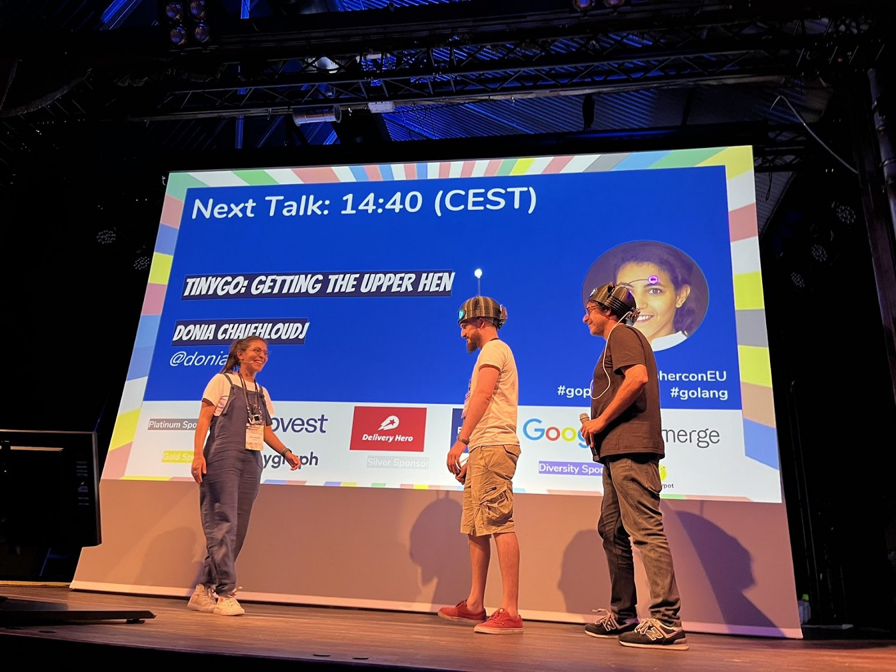

I was very nervous at the beginning and when I started I was very focused on delivering my content. I even made some jokes (and people laughed). People seemed happy at the end and I had great feedback from them. Some want to try TinyGo for their van, 
some show me hen pictures, it was a great moment.

A caption from Mat Ryer twitter while I am blowing on my sensor [here](https://twitter.com/matryer/status/1553368752388964355).

### Panel with the Go Team, Than Macintosh, Cameron Balahan, Michael Knyszek

The Gopher community had the opportunity to ask questions to the Go team and they explained the orientation Go is taking. My 3 key points:

Generics is the biggest change that happened to Go.
Some libraries have not changed for a few years because the person in charge left.
The structure fields optimisation is currently not done by the compiler. For the moment at least because Go must be transparent and it will not be the case if operations were hidden in the compiler. Especially in some cases, the order of the fields is very important, e.g.: protobuf.
Mat Ryer was a great host (all long), bouncing on people’s questions and Go team answers, it was a very insightful panel.

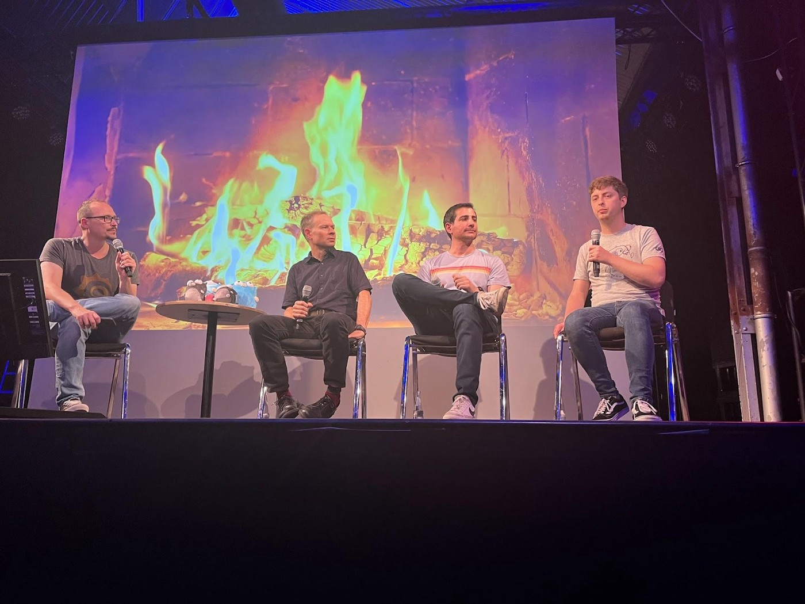

### Career tips for software engineers, Adelina Simion

Adelina delivered her knowledge and tips about careers path. She said “You are the one to take the rising of your career, not your mentor, 
not your team lead” which is very true. Again, I feel that being surrounded by brilliant people, 
friends and mentors helps me along the way to build the best career path possible (for me). 
I leave you with the picture below showing the tips for levelling up your tech skills.

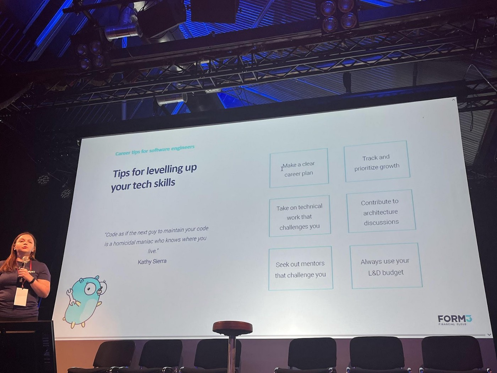

### Go Time

Mat Ryer went live for a Gophers says game! More than 100 gophers had answered a form about the GopherCon Europe and Go. 
Two teams with brilliant Gophers had to guess the answers from the gophers. I had a blast. You can listen to the episode on [Changelog website](https://changelog.com/gotime/241).

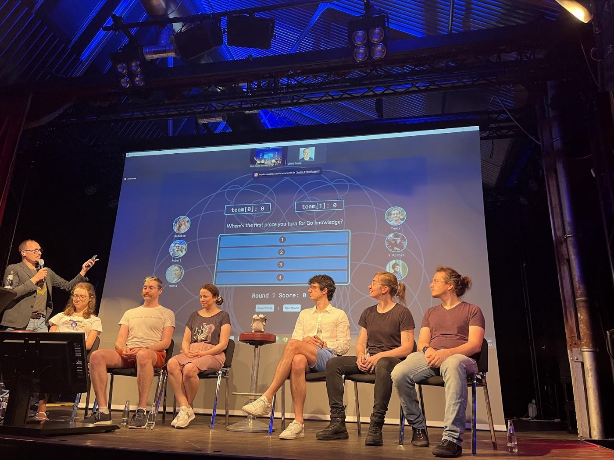

I met amazing people from various companies like Arduino, amazing women, and great gophers! I ended my evening in Berlin visiting the Bundestag which I highly recommend with an audio guide. It gives you an amazing 360 degrees view over Berlin. During the sunset, it is even better. 
I could not attend Sunday because I was leaving but I am very excited to see the replays!

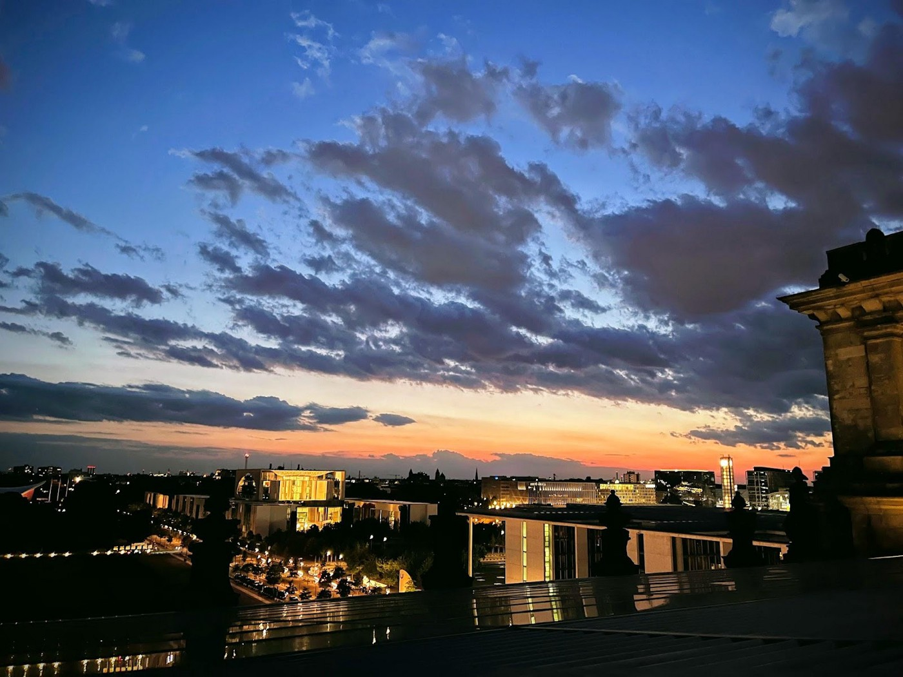

## Thanking GopherCon speech

I take the opportunity to thank my parents for always being there, my partner being my duck, and for going in the morning to buy a second-hand router to save my project. I would like to thank also my dearest friends Aliénor and Pascal for listening to me rehearsing, and correcting my English, their time, their love and for being at the GopherCon. My friend David for his knowledge about Prometheus and Grafana which helps me get my dashboards to the next level. My mentors Guillaume, Adelina, and Mariana for helping me draft my proposal, without them I will not be there.

To finish, thanks to the person that accepted my talk and to the organisers, Donna, Natalie and the Gopher community for being inclusive, educational and the coolest.

If you read the article until here, thanks to you. Let’s connect if it’s not already the case [@doniacld](https://twitter.com/doniacld)

# Some more cool pictures

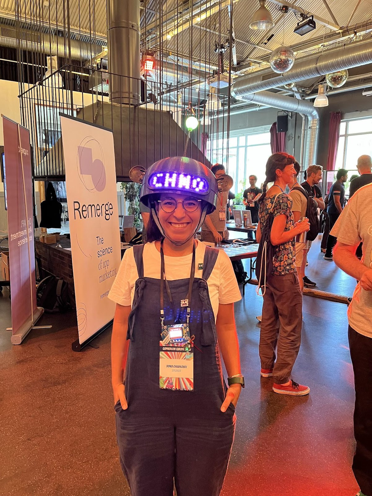

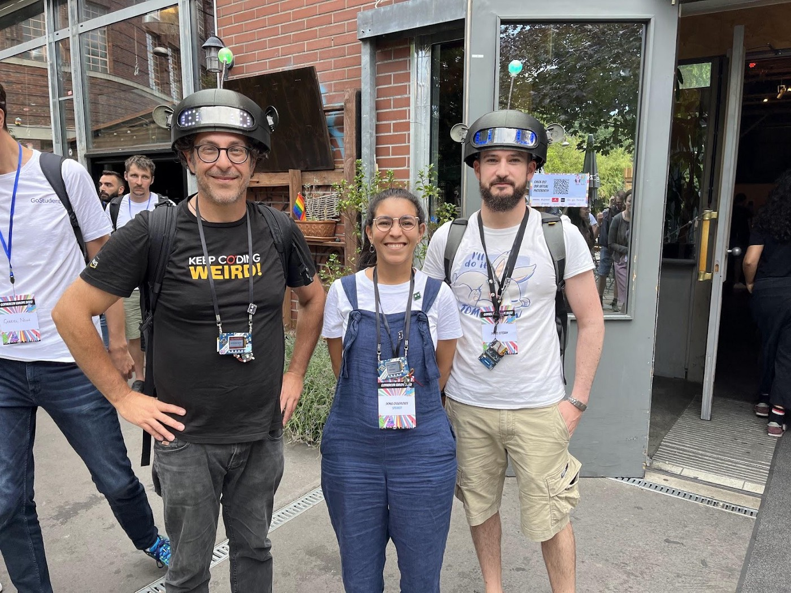
