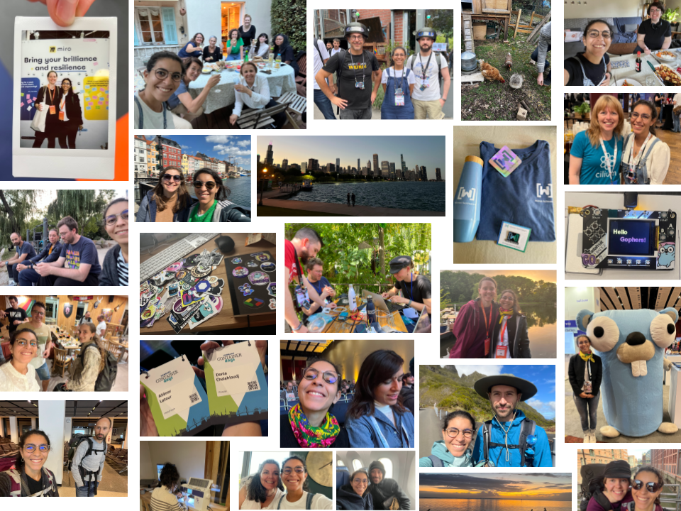
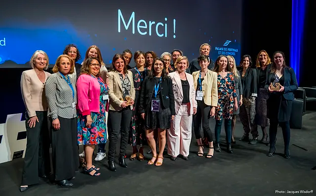

> If I had to describe 2022 in three words: community, travel, and fatigue.

Like many of us, I am looking toward the past at this end of the year, by writing a few lines. 
When a cycle is finished, I do appreciate looking back just to enjoy the new one coming. 
In reality, cycles are part of our life without being calendars. Talking about calendars, 
I tend to prefer birthdays instead of the new year. I feel 2022 is a watershed moment in my life, and I wanted to set 
it in stone by writing this article.

_Collage with pictures mainly selfies with people I love, who inspire me or met during the year around the world_

# My accomplishments 🌻

## How to find $ to run events for women in tech 🧑🏽‍💻

Back in December 2021, Carole Malbrancq (WHAT06 president) wrote to me to submit my application for the Trophies Women In Tech South (France). 
My answer to this request was: “I like what you do for women in STEM, can I join?”. After a call, she wrapped up by asking me what can 
I bring to them, I was very shy and did not know what skills and strengths I could use. Let’s say it, I felt like an impostor.

We decided I could help Carole find sponsors for the Trophies, an enriching task. I was in backup following the meetings with the 
institutions, the companies and other publics to ask for sponsorship to promote women in tech. I learned so much with the WHAT06 team about politics, 
the codes of sponsorship, how to run an event for 300 persons and more.

I feel very grateful to be surrounded by inspiring women pushing others towards the front of the stage. The next step is 
organising a Hackathon on the theme of inclusion theme, I am very excited to emcee it and be part again of 
an event where the cause is so crucial to me.

_WHAT06 team at the Trophies Women In Tech South 2022 - Copyright [Jacques Wisdorff](https://jacques-wisdorff.jimdosite.com/)_

## What drives me? Anything inspiring 🧱
During my innermost questions of 2021, I knew I wanted to organise events for people and reunite them. 
Seeing people bounding thanks to me is the most satisfying feeling (ego, is it you?). In parallel to my activities with WHAT06, 
I started a new Google Developer Group in the south of France: GDG Sophia-Antipolis. Friends joined me on the road and I am very proud to say that we are now a great team of 4 people. We run monthly tech talk events online or in-person promoting diversity and anyone who wants to share their knowledge with the community.

What to focus on when building a tech community:
- be able to delegate;
- organise your work and plan tasks;
- find sponsorships and partners for places, money, and catering;
- market and promote events.

At the end of the year, I was less present for personal reasons, and I felt guilty not being there with the team. 
In fact, I realised that I had managed to build an autonomous organising team, they ran a great tech talk about accessibility. 
And it’s a win for me. Even though the community is not huge, I can say that I have a great team.

_Instant photos from the DevFest 2022 by the GDG Sophia-Antipolis_

## How to navigate the open-source world 🚢
My first Hacktoberfest was in late 202. If you do not know what I am talking about, you can have a glance at my article 
[Changeblogging my first Hacktoberfest](https://doniacld.medium.com/change-blogging-my-first-hacktoberfest-2021-d5845dd791e8)
I found it stressful at the beginning but rewarding. It was the opportunity to understand the codes of this new world, 
discover new projects, learn how to enter an unknown project and some basics about open-source (read CONTRIBUTION.md, respect issues process and pull requests).
This year was the occasion while discovering TinyGo to implement what I learned and make my first contribution by fixing a bug. 
Slowly, I discovered the community especially on the Go slack (Gophers slack). After sharing my knowledge and helping in conferences, 
I have been granted to organiser of the TinyGo project and I could review and merge some PRs (not on the compiler, don’t worry) on GoBadge.

_GopherCon US 2022, preparing Badges boards for the 100 participants of the TinyGo Hack Session the day after with Ron Evans aka [Dead Program](https://twitter.com/deadprogram)_

## Become a public speaker 🎙️ 🐣
This is without a doubt what transformed me the most this year. I had the chance to travel to several countries to give 
talks alone and also with my dear friend Aliénor. I shared my experience, my projects and my TinyGo discoveries and experimentation.
Talking to people was something I knew but building a discourse, respecting a timebox, bringing value to your audience, and 
entertaining the public was definitely not natural. I faced the imposter syndrome of course: I did not have anything ready a few days before the talks.
Spoiler alert, I did succeed in delivering my talks (feedbacks were not so bad 😀) and I met incredible people from the Go and 
Cloud community. Today, from my point of view, my biggest success is finally that I inspired people and women to try IoT, Go and take the stage themselves. 

_GopherCon US 2022, giving my talk [TinyGo: Getting the Upper Hen](https://www.youtube.com/watch?v=D46NzhBoQC0)_

Other stuff I am proud of and will not elaborate on:
- Embark for a new adventure working for a startup.
- Begin to learn a new instrument: the clarinet.
- Face my fear of water (I am such a bad swimmer) and passed my first level of scuba diving.
- Co-authoring a book to teach Go with my best friends (for a later article too).

# My challenges 🥀

Successes are rarely going without some failures or difficulties at least. 2022 was an enriching year and incredible in many ways,
but I had to overcome hardships. I sowed many seeds at the same time, they all flourished at the same time, and I could not harvest everything. 

My calendar was too busy, and I felt overwhelmed with some consequences:
- an exhaustion; Between work, my activities as organiser plus the talks to prepare and the travel, I flirted with burnout ☠️. 
- I realised it in time and paused for a week, cancelled a trip for a conference and stayed home just chilling.
- not much time for my family and my friends; I sadly neglect people I love and put all my energy into myself and my tech/community projects. 
- My family life and friends suffered from it and I felt so guilty not being there. I was too busy with projects and calls where I was engaged. 
- I lost a loved one I did not see because I privileged conferences. I still regret it and it was the most emotionally complex situation I faced in my adult life. 

> What doesn't kill you, makes you stronger. Friedrich Nietzsche

Indeed.

# My learnings 🧑‍🏫

## 1. Define your priorities
The 2022 year was focused on myself, my career and how I could contribute to communities forgetting my beloved ones. 
This year, I wish to redefine my priorities and find a better balance between career and family. Probably do fewer things but with better quality. 
I am still glad to have experienced all of these new opportunities.

## 2. Surround yourself with the right persons
I talked a lot in the first person about my accomplishments, but I was never alone. My spouse, parents and friends have 
always been there during my questioning to guide me, listen to me and give feedback at my talk rehearsals, correct and proof-read my projects, 
and smile at me while I am on stage. I nominate [Aliénor](https://www.linkedin.com/in/alienor-latour/), [Pascal](https://www.linkedin.com/in/pascal-bertrand-work/), 
[David](https://0xdc.me/), the [TinyGo community](https://twitter.com/tinygolang), and the Women Developer Academy community.

My companions of events who were there to build the dreamin’ tech community: the women behind [WHAT06](https://www.linkedin.com/company/what06/) and my [GDG team](https://www.linkedin.com/company/gdg-sophia-antipolis/).

I was told in events for women in tech how mentors could help you as allies in your career. It can be formal relationships but also informal ones. 
I had the chance to meet mentors during this year who helped me to take a step back and ask me difficult questions about myself, my career and my choices in general: 
I nominate [Carole](https://www.linkedin.com/in/carole-malbrancq-39273711/), [Mariana](https://www.linkedin.com/in/marianabocoi/), [Adelina](https://www.linkedin.com/in/adelina-simion/) and [Guillaume](https://www.linkedin.com/in/guillaume-blaquiere-38693b15/).
Find yourself some mentors. I would be happy to help.

I say it pretty often, let’s say it one more time: being surrounded by the right people is my key to success.

## 3. Value every moment
My last one finally is to enjoy each bite of simplicity, joy and of reality. Getting older just 
makes me realise how much everything is so fragile. I am stopping right now with my cliché. 🤭

_Enjoying the sunset in a hammock at L’île de la Réunion._

# Conclusion 👩🏽‍🌾

I lived a year at 100 km/h, now it’s time to cool down and enjoy.  
I did not setup SMART objectives for this new year... instead I made a list of things:
- 💌 Take care of myself and my loved ones
- 📖 Continue to learn stuff about Go
- 🔌 Develop my networking skills
- 🧑‍💻 Contribute to open-source projects
- 🎶 Keep going playing the clarinet (maybe more often)
- 🧵 Sew more pieces (a jumpsuit for talks and bridesmaid dress at least)
- ⛰️ Hiking on more mountains
- ✍️ Write articles and share them with you 🙂

Wishing you, dear reader, joy and health for this new cycle! 

---

Follow me for more content:  
Mastodon: https://hachyderm.io/@doniacld  
Twitter: https://twitter.com/doniacld  
LinkedIn: https://www.linkedin.com/in/donia-chaiehloudj/  
Github: https://github.com/doniacld  
