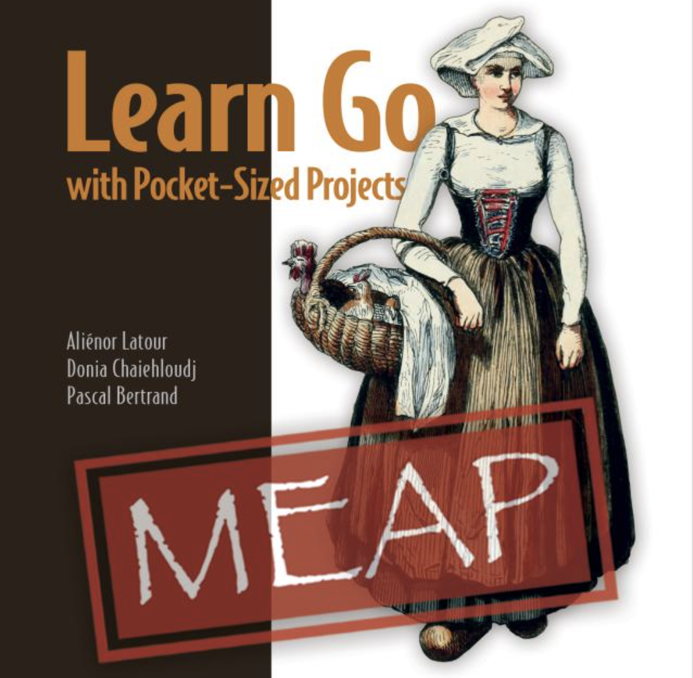

# Co-author of the book: Learn Go with Pocket-Sized Projects

Co-authoring a book at Manning to teach Go with end to end projects with Aliénor Latour and Pascal Bertrand.  

Early Access is available on [Manning website](https://www.manning.com/books/learn-go-with-pocket-sized-projects?utm_source=donia&utm_medium=affiliate&utm_campaign=book_latour_learn_1_5_23&utm_content=email). 

_Cover of the book Learn Go With Pocket-Sized Projects in MEAP_

# Code contributions

Since Hacktoberfest 2021, I began to contribute to open source projects:
- [revive](https://github.com/mgechev/revive): a linter for Go
- [tinygo drivers](https://github.com/tinygo-org/drivers): tinygo is a Go compiler for microcontrollers
- [tinygo badge](https://github.com/tinygo-org/gobadge): Run tinygo programs on an Adafruit board

# Events organisation

I founded in 2022 a local chapter of Google Developer Group to organise tech events. We are now a team of 4 people running remote and in-person events with the tech community.
You can find the past and coming events on the [GDG Sophia-Antipolis page](https://gdg.community.dev/gdg-sophia-antipolis/) and the remote hosted events on YouTube:

<aside>
<iframe width="560" height="315" src="https://www.youtube.com/embed/FVz1S4cKG4M" title="YouTube video player" frameborder="0" allow="accelerometer; autoplay; clipboard-write; encrypted-media; gyroscope; picture-in-picture" allowfullscreen></iframe>
</aside>
